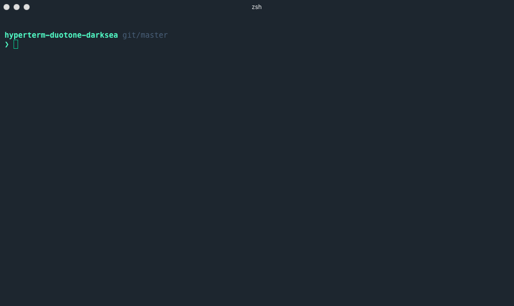

# hyperterm-duotone-darksea

> Duotone Dark Sea [HyperTerm](https://hyperterm.org) theme

Inspired by the [Duotone](http://simurai.com/projects/2016/01/01/duotone-themes) themes by [Simurai](http://simurai.com/).

Inspired by [hyperterm-snazzy](https://github.com/sindresorhus/hyperterm-snazzy) theme by [sindresorhus](https://github.com/sindresorhus)

## Install

Add `hyperterm-duotone-darksea` to the plugins list in your `~/.hyperterm.js` config file.

> I'm using [pure-prompt](https://github.com/sindresorhus/pure) by [sindresorhus](https://github.com/sindresorhus)

## License

MIT © [Kurtis Kemple](https://twitter.com/kurtiskemple)
