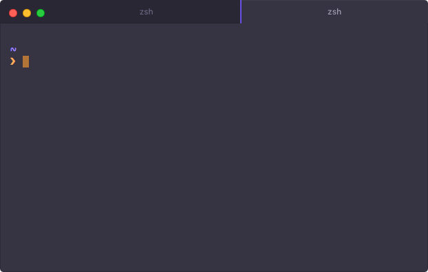

# hyperterm-duotone-dark

> Duotone Dark [HyperTerm](https://hyperterm.org) theme

Based on the [Duotone](http://simurai.com/projects/2016/01/01/duotone-themes) Atom themes by [Simurai](http://simurai.com/).

## Install

Add `hyperterm-duotone-dark` to the plugins list in your `~/.hyperterm.js` config file.

## Resources

- [Original theme for Atom on
  Github](https://github.com/simurai/duotone-dark-syntax/blob/master/styles/colors.less)
- [Base2Tone iTerm2 theme](https://github.com/atelierbram/Base2Tone-iterm2)

## License

MIT 
